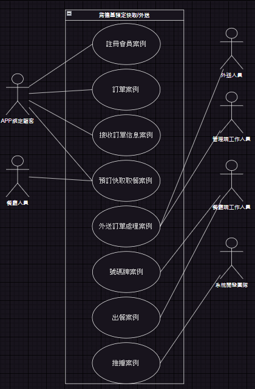
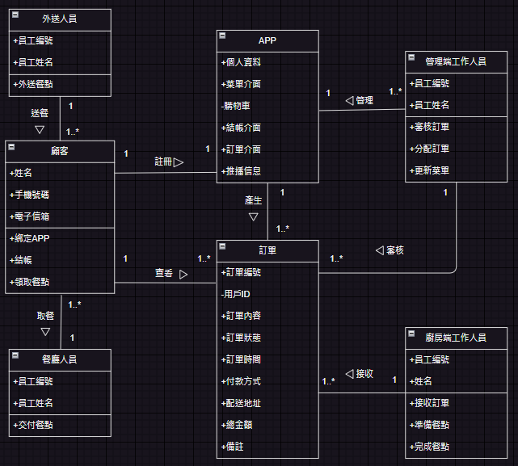

# 期末報告
>
>組員學號：111111102.111111224
> 
>組員姓名：張紘榤、邱武昱
> 

本份文件包含以下主題：
- [x] 簡易紀錄
- [x] 內容

## 簡易紀錄
隨著社會節奏的加快和生活方式的改變，外送需求逐漸增加，使得便利的訂餐方式變得日益重要。為了滿足顧客對便利性和服務質量的需求，為此，他們決定委託一個專業的系統開發團隊開發一款全新的線上訂餐APP。這款APP將提供一系列功能，從菜單瀏覽到訂餐選擇、支付方式、優惠券使用等，以減少人工錯誤，提高訂單處理效率，並提供更優質的顧客服務。以下為系統訪談人員與該餐飲公司主管之隨手紀錄：  

可分為前台和後台。在前台，顧客可以下載並安裝APP，使用手機號碼或電子信箱註冊並登錄。登錄後，顧客可以瀏覽菜單，選擇想要的餐點，添加到購物車中。確認所需數量和品項正確後，在結帳過程中，顧客可以選擇是否使用優惠券，以及選擇「預訂快取」或「即時外送」服務，並選擇付款方式（現金或信用卡）。提交訂單後，系統將自動發放訂單號碼（用於預定快取）或預計送達時間（用於外送），並將訂單信息及時傳送至廚房端。若假設顧客是選擇預訂快取方式取餐的顧客，可以於取餐時間前往肯德基餐廳取餐。在餐廳內，顧客可以到專門的預訂快取通道，出示訂單號碼，餐廳人員會迅速為他們準備好預訂的餐點，以供領取。  

在後台，系統供管理端和廚房端使用。管理端負責訂單的審核和分配，包括審核預定快取訂單、即時分配給餐廳人員，審核外送訂單並及時分派給外送員。此外，管理端還負責更新菜單(上架、修改、下架)。廚房端則負責接收、處理和完成訂單，根據收到的訂單單據進行備餐，並依照號碼牌順序出餐給餐廳人員，以便交付給顧客。同時，系統還支持支付通知、訂單追蹤和推送通知功能。以提供更完善的訂餐體驗和顧客服務。
## 內容
### 利害關係人目標表
|利害關係人|目標|
|---|---|
| **前台：** |
|顧客|1.方便快捷地訂購餐點 2.靈活的付款和優惠選擇 3.清晰的訂單追蹤和快速取餐 4.獲取最新信息和優惠 5.獲得高品質的餐點和服務 6.簡便的顧客服務和反饋機制 7.個性化推薦和定制服務 8.便捷的賬戶管理|
|餐廳人員|1.高效驗證訂單 2.迅速準備和交付餐點 3.良好的顧客服務|
|外送人員|1.準時取餐和送餐 2.確保餐點完好無損 3.準確的信息溝通|
| **後台：** | 
|管理端工作人員|1.有效管理訂單流程 2.保持菜單信息準確 3.提升顧客服務|
|廚房端工作人員|1.高效備餐 2.精確出餐 3.內部溝通與協作|
|系統開發團隊|1.開發功能完善的APP 2.提高系統性能和穩定性 3.提供可靠的訂單管理和追蹤功能|

### 事件表
|目標|使用案例|
|---|---|
|使用者從應用商店下載APP並進行註冊會員帳號。|1. 註冊會員案例|
|顧客選擇想要的餐點並添加到購物車中，並確認所需數量和品項正確後進行結帳。|2. 訂單案例|
|顧客接收訂單號碼（預訂快取）或預計送達時間（外送）。|3. 接收訂單信息案例|
|顧客到專門的預訂快取通道，出示訂單號碼，餐廳人員交付餐點。|4. 預訂快取取餐案例|
|管理端工作人員審核外送訂單並分派給外送人員。|5. 外送訂單處理案例|
|在顧客送出訂單並產生號碼牌後，廚房端工作人員接收並處理訂單。|6. 號碼牌案例|
|廚房端工作人員烹飪完成後，依照號碼牌順序出餐。|7. 出餐案例|
|系統向顧客發送推送通知，如優惠信息、訂單狀態等。|8. 推播案例|  
### 使用案例圖

### 使用案例

### 初步類別圖

### 系統循序圖

### 合約